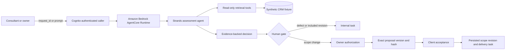

# FairChange architecture

The deployed runtime receives JSON and returns a structured assessment. Retrieval is read-only: the model can inspect the fixture's scope clauses, correspondence, estimates, and existing tasks but cannot send messages or change scope directly.

The local workflow persists a cursor, assessments, and internal tasks in replace-based JSON state. The resolution workflow persists the proposal, owner authorization, client acceptance, scope revision, and delivery task as one recoverable state update. The local HMAC client is explicitly a test boundary; production identity should be supplied by the host application's identity provider.

The runtime validates Cognito bearer tokens at the AgentCore boundary. IAM is the AWS deployment and administration path; a server-side administrative caller still needs least-privilege `bedrock-agentcore:InvokeAgentRuntime` access. AWS credentials and bearer tokens belong on the server side, never in a browser.
